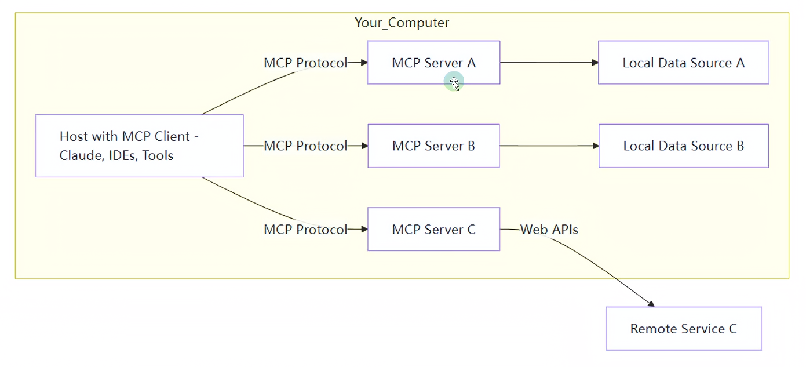
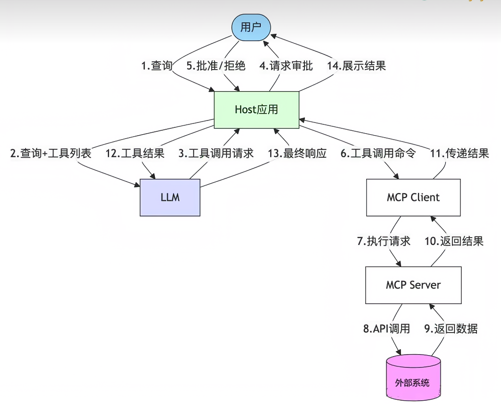

# MCP
## 1. MCP是什么
MCP(Model Context Protocol)模型上下文协议
为大语言模型提供统一的、标准化的方式进行连接家有儿女

***

## 2. 资源
github查看
+ MCP官方资源 : https://github.com/modelcontextprotocol/servers
+ **MCP热门资源** : https://github.com/punkpeye/awesome-mcp-servers
其他平台
+ Glama : https://glama.ai/mcp/servers
+ **Smithery** : https://smithery.ai
+ cursor : https://cursor.directory
+ MCP.so : https://mcp.so/zh
+ 阿里云百炼 : https://bailian.console.aliyun.com/?tab=mcp#/mcp-market

***

## 3. MCP的通信机制
1. stdio(标准输入输出) 用于本地服务
2. SSE(Server-Sent Events) 用于远程通信服务

***

## 4. stdio的本地环境安装
stdio的本地环境有两种
1. python编写 : uvx
2. TypeScript编写 : npx

+ uvx安装
`pip install uv`
注意要配置环境变量
`pip show uv` 可以查找所在位置
Location: C:\Users\<用户名>\AppData\Roaming\Python\Python311\site-packages
它的上一级目录通常会包含可执行文件 uv.exe
C:\Users\<你的用户名>\AppData\Roaming\Python\Python311\Scripts\uv.exe
可以将
C:\Users\<你的用户名>\AppData\Roaming\Python\Python311\Scripts\
写入环境变量

+ npx安装
下载Node.js
https://nodejs.org/zh-cn

***

## 5. 在Cursor中使用MCP
以一个具体需求入手
编写一个北京一日游的出行攻略
1. 从高德地图的MCP服务中获取北京站到天安门、天安门到颐和园、颐和园到同锣鼓巷的地铁线路图并保存在数据库beijing_trip的表subway_trips中
2. 从高德地图的MCP中获取颐和园、南锣鼓巷附件的美食信息，每处获取三家美食店铺信息，并将相应的信息存入表location_foods中
3. 在工作目录下创建一个新的文件夹,命名为“北京旅行”，在其中创建两个txt，分别从数据库中将两个表的内容提取出存放进去
4. 最后根据txt中的内容，生成一个精美的html前端展示页面并存放在该目录下

选择MCP Server平台
MySQL服务，高德地图服务，filesystem服务

在cursor中有两种方式设置MCP
1. 全局设置
设置 -> tools
2. 项目设置
.cursor目录中新建mcp.json文件进行配置

编写一个上海一日游的出行攻略
1. 从高德地图的MCP服务中获取需要的地铁线路图并保存在数据库shanghai_trip的表subway_trips中
2. 从高德地图的MCP中旅行路线附件的美食信息，每处获取三家美食店铺信息，并将相应的信息存入表location_foods中
3. 在工作目录下创建一个新的文件夹,命名为“上海旅行”，在其中创建两个txt，分别从数据库中将两个表的内容提取出存放进去
4. 最后根据txt中的内容，生成一个精美的html前端展示页面并存放在该目录下

***

## 6. MCP的工作原理
MCP是C/S架构
包含以下几个核心概念
+ MCP主机(MCP Hosts)
运行MCP的主应用程序,例如claude Desktop，cursor
+ MCP客户端(MCP Clients)
+ MCP服务器(MCP Servers)
+ 本地资源(Local Resources)
+ 远程资源(Remote Resources)

