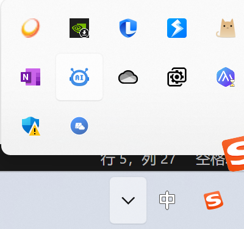
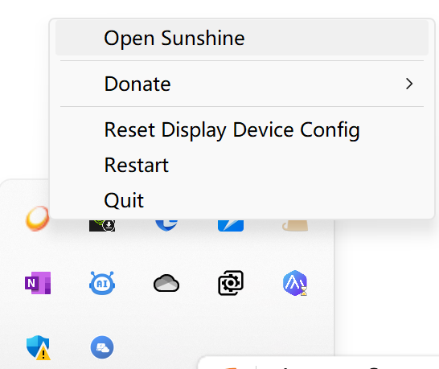
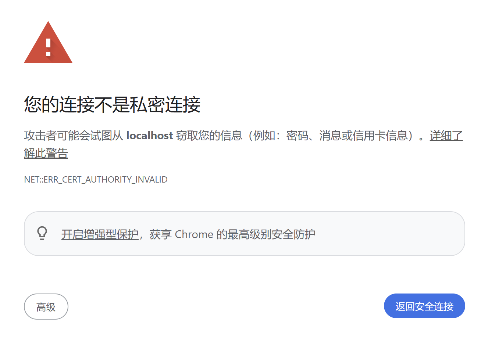
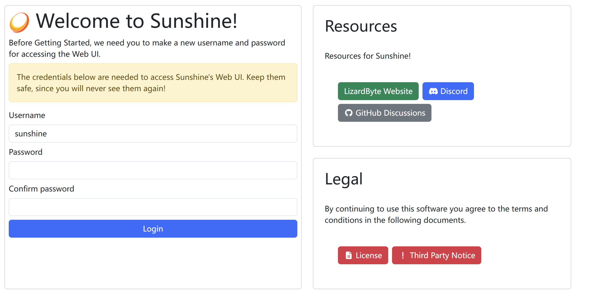
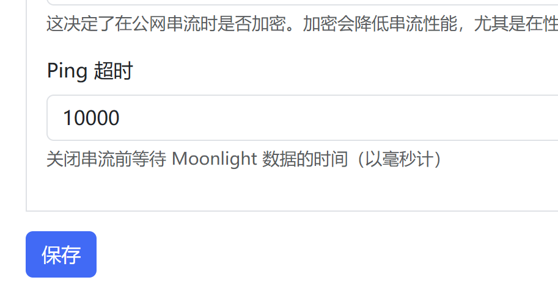
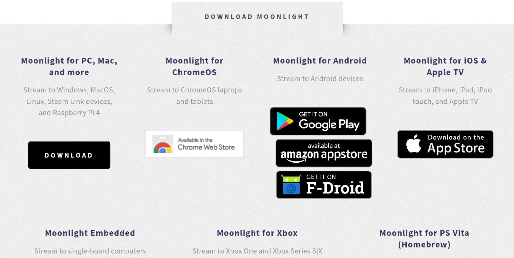
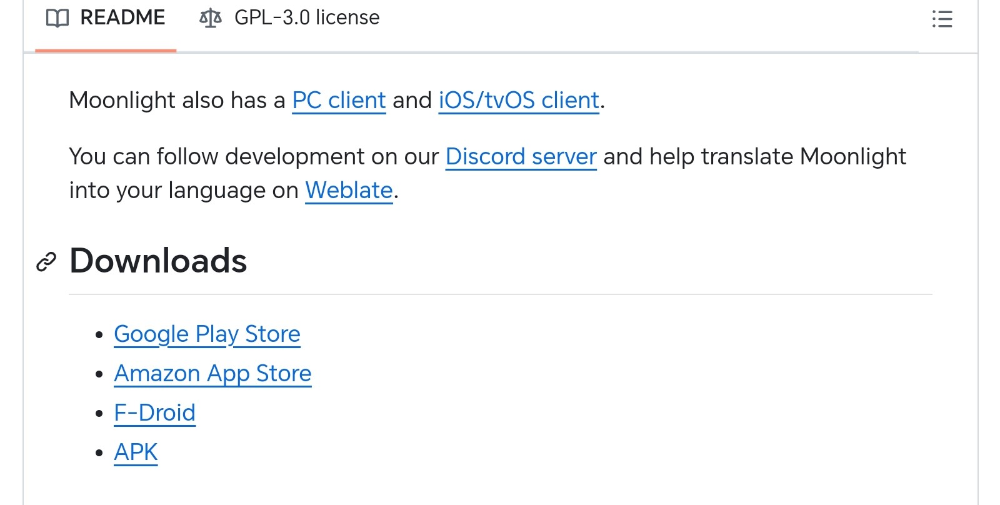
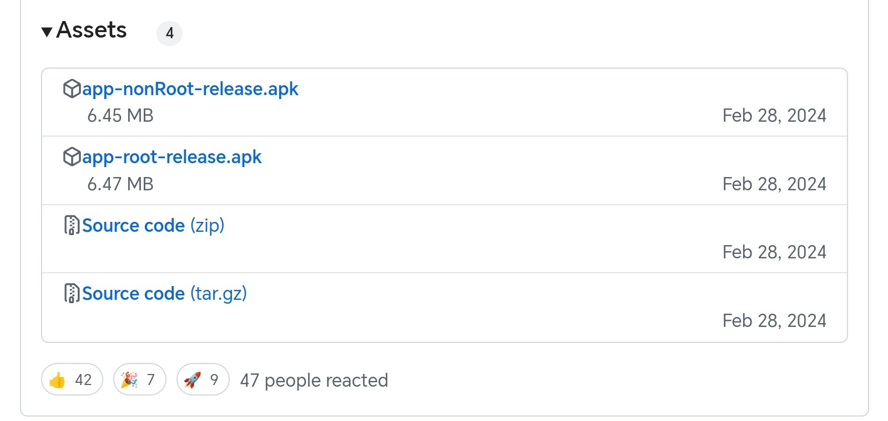
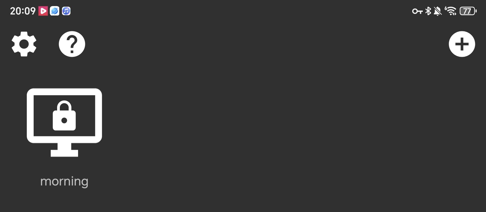

平板副屏实现方案
1.  电脑安装 Sunshine
    Sunshine官网 ： https://app.lizardbyte.dev/Sunshine/?lng=zh-CN
    安装时没有特殊要求
    安装完成状态栏会出现 Sunshine 图标
    
    右击图标,选择 Open Sunshine
    
    会显示网页不安全，点击高级接受即可
    
    创建用户名和密码
    
***
2.  配置 Sunshine
    配置 -> Network -> UPnP : 启用 -> IP地址族 ：IPv4 + IPv6
    记得保存
    
***
3.  平板安装 moonlight
    Moonlight官网：https://moonlight-stream.org
    向下划，选择 Moonlight for Andorid
    
    进入 github , Downloads 选择 APK
    
    Assets中
    app-nonRoot-release.apk 为无需root权限版本
    app-root-release.apk 为需要root权限版本
    选择 app-nonRoot-release.apk 即可
    
***
4.  配合串流
    如果 Moonlight 中没有自动显示电脑端，则需手动添加电脑IP地址(右上角加号)
    
    获取IP地址方法 
    win + R -> cmd -> ipconfig -> IPv4 地址
    进入 Sunshine 后台输入 Pin码
    